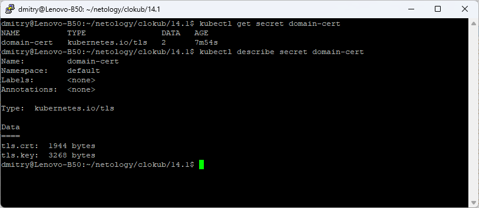
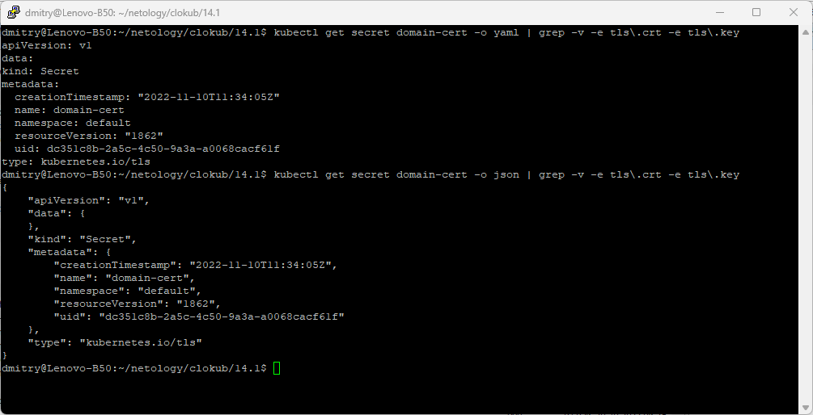
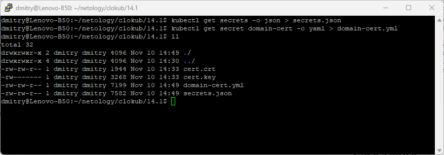

# Домашняя работа к занятию 14.1 «Создание и использование секретов»

## Задача 1: Работа с секретами через утилиту kubectl в установленном minikube

> Выполните приведённые ниже команды в консоли, получите вывод команд. Сохраните
задачу 1 как справочный материал.

### Как создать секрет?

> ```
> openssl genrsa -out cert.key 4096
> openssl req -x509 -new -key cert.key -days 3650 -out cert.crt \
> -subj '/C=RU/ST=Moscow/L=Moscow/CN=server.local'
> kubectl create secret tls domain-cert --cert=certs/cert.crt --key=certs/cert.key
> ```


### Как просмотреть список секретов?

> ```
> kubectl get secrets
> kubectl get secret
> ```


### Как просмотреть секрет?

> ```
> kubectl get secret domain-cert
> kubectl describe secret domain-cert
> ```



### Как получить информацию в формате YAML и/или JSON?

> ```
> kubectl get secret domain-cert -o yaml
> kubectl get secret domain-cert -o json
> ```



### Как выгрузить секрет и сохранить его в файл?

> ```
> kubectl get secrets -o json > secrets.json
> kubectl get secret domain-cert -o yaml > domain-cert.yml
> ```



### Как удалить секрет?

> ```
> kubectl delete secret domain-cert
> ```


### Как загрузить секрет из файла?

> ```
> kubectl apply -f domain-cert.yml
> ```


## Задача 2 (*): Работа с секретами внутри модуля

> Выберите любимый образ контейнера, подключите секреты и проверьте их доступность
> как в виде переменных окружения, так и в виде примонтированного тома.


