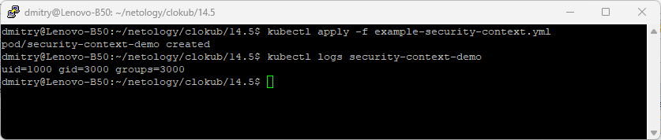
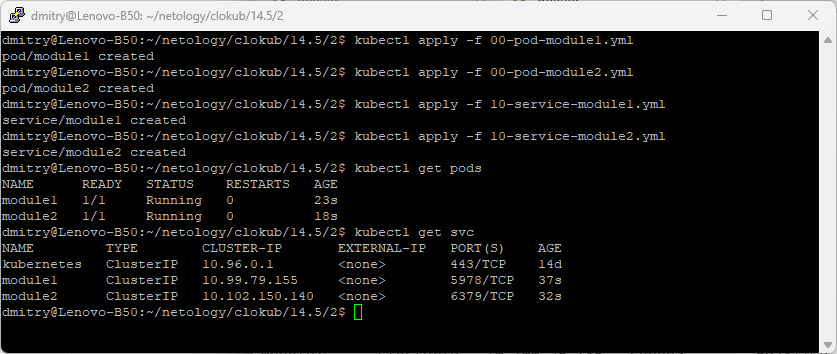
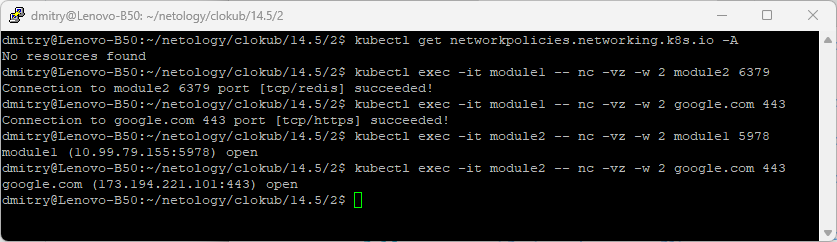
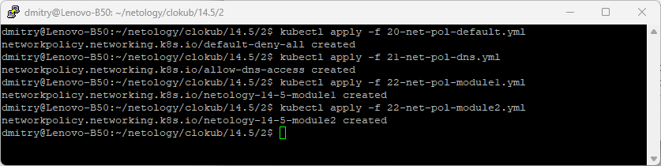
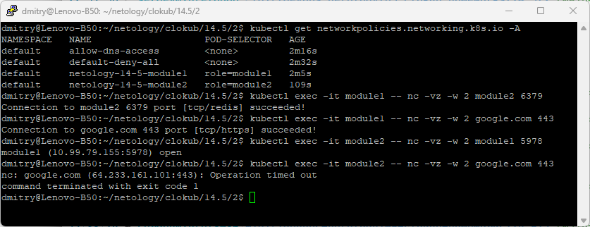

# Домашняя работа к занятию 14.5 «SecurityContext, NetworkPolicies»

## Задача 1: Рассмотрите пример 14.5/example-security-context.yml

> Создайте модуль
>
> ```
> kubectl apply -f 14.5/example-security-context.yml
> ```
>
> Проверьте установленные настройки внутри контейнера
>
> ```
> kubectl logs security-context-demo
> uid=1000 gid=3000 groups=3000
> ```



## Задача 2 (*): Рассмотрите пример 14.5/example-network-policy.yml

> Создайте два модуля. Для первого модуля разрешите доступ к внешнему миру
> и ко второму контейнеру. Для второго модуля разрешите связь только с
> первым контейнером. Проверьте корректность настроек.

Манифесты:
1. Поды и сервисы:
   - [00-pod-module1.yml](14.5/2/00-pod-module1.yml)
   - [00-pod-module2.yml](14.5/2/00-pod-module2.yml)
   - [10-service-module1.yml](14.5/2/10-service-module1.yml)
   - [10-service-module2.yml](14.5/2/10-service-module2.yml)
2. Сетевые политики:
   - [20-net-pol-default.yml](14.5/2/20-net-pol-default.yml) - политика по-умолчанию, всё запретить
   - [21-net-pol-dns.yml](14.5/2/21-net-pol-dns.yml) - доступ для всех подов к CoreDNS Кубернетиса, чтобы поды могли обращаться друг к другу по хостнеймам
   - [22-net-pol-module1.yml](14.5/2/22-net-pol-module1.yml) - политика для первого модуля согласно задания
   - [22-net-pol-module2.yml](14.5/2/22-net-pol-module2.yml) - политика для второго модуля согласно задания

Проверка:
1. Создание подов и сервисов:


2. Проверка, что у обоих модулей есть доступ друг к другу и в интернет. Первая команда - подтверждение, что сетевые политики не настроены:


3. Применение сетевых политик:


4. Проверка, что сетевые политики настроены, затем проверяю результат: у первого пода есть доступ ко второму и в интернет, а у второго только к первому:


